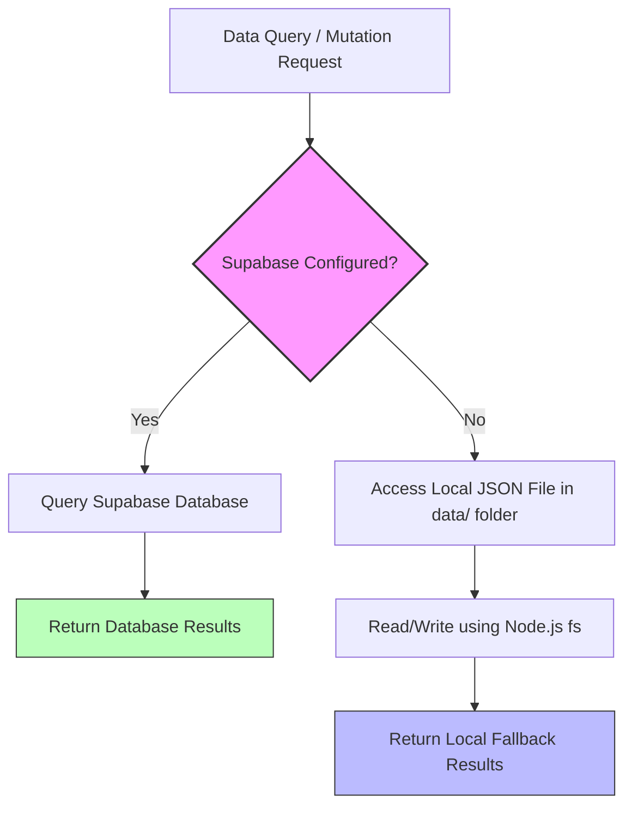

# Technical Architecture Guide

This document describes the design decisions, code organization, and technical flow of the Blog Website application.

---

## 1. Directory Structure Overview

Below is the structure of the codebase, highlighting key configuration points:

```text
blog-website/
├── data/                       # Local database folder (JSON fallbacks)
│   ├── posts.json              # Local fallback for blog posts
│   ├── users.json              # Local fallback for admin panel users
│   └── app-settings.json       # Local fallback for global site configurations
├── document/                   # Project Documentation & Resources (Contains all docs!)
│   ├── README.md               # Folder landing page / index
│   ├── db_schema.sql           # Database schema setup script
│   ├── setup_guide.md          # Setup instructions
│   ├── architecture.md         # Technical architecture details
│   └── env.example             # Blank environment variables template
├── public/                     # Static assets (images, fonts, vendor styles)
│   ├── uploads/                # Directory where local media uploads are saved
│   └── vendor/                 # Third-party theme CSS and JS assets
├── src/
│   ├── app/                    # Next.js App Router directories
│   │   ├── (backend)/          # Backend API services & database queries
│   │   │   ├── api/            # API routes (CORS, contacts, user, settings, etc.)
│   │   │   └── lib/            # Backend helper libraries (postStore, userStore, etc.)
│   │   ├── (dashboard)/        # Admin Control Panel pages
│   │   │   ├── components/     # Dashboard specific UI components (Sidebar, Select, etc.)
│   │   │   ├── dashboard/      # Next.js pages for /dashboard routes
│   │   │   └── lib/            # Dashboard contexts (notifications)
│   │   ├── (frontend)/         # Frontend blog views
│   │   │   ├── components/     # Frontend UI components (recent posts, headers, etc.)
│   │   │   ├── lib/            # Frontend state, authContext, accentTheme, etc.
│   │   │   ├── posts/          # Dynamic post views [/posts/[slug]]
│   │   │   └── page.jsx        # Root landing page.jsx
│   │   ├── globals.css         # Global Tailwind v4 styles
│   │   └── layout.jsx          # Root Layout for HTML body
│   └── proxy.js                # Local proxy controller
├── next.config.mjs             # Next.js configuration
├── package.json                # Project dependencies and scripts
└── README.md                   # Root README pointing to the document folder
```

---

## 2. Hybrid Data Architecture & Local Fallback Store

One of the key features of this application is its **hybrid data storage** capabilities. It provides full backend functionality out of the box using local JSON files, with a seamless upgrade path to **Supabase** (Postgres).

### Flow Control Diagram



### Implementation Details

This fallback logic is handled in the following files:

1. **`src/app/(backend)/lib/postStore.js`**
   - Contains functions like `getAllPosts()`, `getPostBySlug()`, `createPostRecord()`, and `updatePostRecord()`.
   - Checks the configuration boolean `isSupabaseConfigured` from [supabase.js](../src/app/(backend)/lib/supabase.js).
   - If `true`, queries the `posts` table on Supabase.
   - If `false`, falls back to read/write JSON operations on `data/posts.json` and manages file uploads locally inside `public/uploads/posts/`.

2. **`src/app/(backend)/lib/userStore.js`**
   - Manages authentication users.
   - Falls back to `data/users.json` when Supabase credentials are not found.
   - When a Supabase configuration is added later, the store automatically **seeds** all local users from `data/users.json` into Supabase (`blog_users` table) upon the first query, ensuring zero data loss.

3. **`src/app/(backend)/lib/appSettings.js`**
   - Manages site-wide customizations (such as theme accents, active slider posts, and sidebar placements).
   - Falls back to `data/app-settings.json`.

---

## 3. Custom Interactive UI/UX Implementations

Recent modifications have introduced state-of-the-art visual components to enhance the admin dashboard and home feed experience:

### A. CSS-Animated Hamburger Toggle Menu
* **Files**: [dashboard.module.css](../src/app/(dashboard)/components/dashboard.module.css) (`.hamburgerIcon` / `.hamburgerIconOpen`)
* **Details**: Custom three-line hamburger toggler that utilizes smooth CSS transforms. Upon click (when the sidebar is expanded), the middle line fades out (`opacity: 0`) and the top/bottom lines rotate in opposite directions by 45 degrees, forming a clean close ("X") icon. This has been unified across all 10 dashboard client routes for design consistency.

### B. Sticky-Slider Masonry Alignment
* **Files**: [RecentPosts.jsx](../src/app/(frontend)/components/recent-posts/RecentPosts.jsx)
* **Details**: To prevent spacing issues in the 3-column masonry layout, if a pinned/sticky post (span=2) and a slider post (span=1) exist on the same page, the frontend automatically reorders them so they are positioned together at the top of the feed (filling the first row). Any subsequent incoming posts are rendered directly below them.
