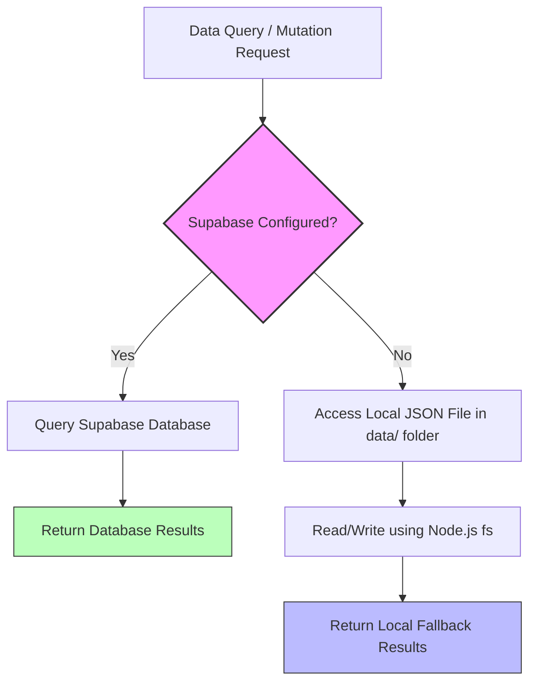

# Technical Architecture Guide

This document describes the design decisions, code organization, and technical flow of the Blog Website application.

---

## 1. Directory Structure Overview

Below is the structure of the codebase, highlighting key configuration points:

```text
blog-website/
├── data/                       # Local database folder (JSON fallbacks)
│   ├── posts.json              # Local fallback for blog posts
│   ├── users.json              # Local fallback for admin panel users
│   └── app-settings.json       # Local fallback for global site configurations
├── document/                   # Project Documentation & Resources (Contains all docs!)
│   ├── README.md               # Folder landing page / index
│   ├── db_schema.sql           # Database schema setup script
│   ├── setup_guide.md          # Setup instructions
│   ├── architecture.md         # Technical architecture details
│   └── env.example             # Blank environment variables template
├── public/                     # Static assets (images, fonts, vendor styles)
│   ├── uploads/                # Directory where local media uploads are saved
│   └── vendor/                 # Third-party theme CSS and JS assets
├── src/
│   ├── app/                    # Next.js App Router directories
│   │   ├── api/                # Backend API routes (CORS, contacts, etc.)
│   │   ├── dashboard/          # Admin Control Panel pages and layout
│   │   ├── posts/              # Frontend blog posts view
│   │   ├── globals.css         # Global Tailwind and custom styles
│   │   └── page.jsx            # Homepage rendering and layouts
│   ├── components/             # Reusable UI React components
│   │   ├── footer/             # Global layout footer
│   │   ├── header/             # Global layout header and navigation
│   │   ├── post/               # Single post UI, audio player, video views
│   │   └── slider/             # Hero slider and carousels
│   └── lib/                    # Business logic and database clients
│       ├── appSettings.js      # App setting store (local / Supabase)
│       ├── authContext.jsx     # User authentication and session management
│       ├── postStore.js        # Post data logic handler
│       ├── sanity.js           # Sanity CMS API queries and configuration
│       ├── supabase.js         # Supabase client instantiation
│       └── userStore.js        # User credentials logic handler
├── next.config.mjs             # Next.js configuration
├── package.json                # Project dependencies and scripts
└── README.md                   # Root README pointing to the document folder
```

---

## 2. Hybrid Data Architecture & Local Fallback Store

One of the key features of this application is its **hybrid data storage** capabilities. It provides full backend functionality out of the box using local JSON files, with a seamless upgrade path to **Supabase** (Postgres) and **Sanity CMS**.

### Flow Control Diagram



### Implementation Details

This fallback logic is handled in the following files:

1. **`src/lib/postStore.js`**
   - Contains functions like `getAllPosts()`, `getPostBySlug()`, `createPostRecord()`, and `updatePostRecord()`.
   - Checks the configuration boolean `isSupabaseConfigured` from [src/lib/supabase.js](file:///c:/Users/T14s/Desktop/blog-website/src/lib/supabase.js).
   - If `true`, queries the `posts` table on Supabase.
   - If `false`, falls back to read/write JSON operations on `data/posts.json` and manages file uploads locally inside `public/uploads/posts/`.

2. **`src/lib/userStore.js`**
   - Manages authentication users.
   - Falls back to `data/users.json` when Supabase credentials are not found.
   - When a Supabase configuration is added later, the store automatically **seeds** all local users from `data/users.json` into Supabase (`blog_users` table) upon the first query, ensuring zero data loss.

3. **`src/lib/appSettings.js`**
   - Manages site-wide customizations (such as theme accents, active slider posts, and sidebar placements).
   - Falls back to `data/app-settings.json`.

---

## 3. Frontend & Styling System

- **Framework**: Built on React 19 and Next.js 16. The application leverages Next.js App Router for server-side rendering (SSR) and routing.
- **Styling**: Powered by **TailwindCSS v4**, using the `@tailwindcss/postcss` builder.
- **Design System**: Global custom CSS styling is defined inside [src/app/globals.css](file:///c:/Users/T14s/Desktop/blog-website/src/app/globals.css), combining standard Tailwind utility classes with custom styles for clean layout rendering.
- **Components**: UI blocks are structured logically under `src/components/`, isolating features like slider controls, lightbox galleries, and custom audio players into reusable React components.
